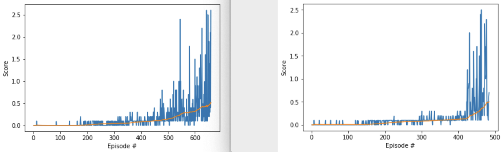

# DRL - Multi-Agent DDPG Algorithm - Tennis Collaboration

## Overview
Using the Unity agent/environment "Tennis", this deep reinforcement learning task trains two AI agents to play tennis with each other in a cooperative way. The agents are rewarded for keeping the ball in play as long as possible. The task is considered solved when the average reward of the winning agent each episode hits 0.5 over 100 consecutive episodes.

The agents receive feedback in the form of a reward after taking each action. They decide whether to move their rackets forward or backward and at what velocity. They also can decide to jump. A +0.1 reward is given if the agent hits the ball over the net and a -0.01 penalty if they miss the ball or hit it out of bounds. The algorithm provides to each agent the velocity and position of both agents and the ball, but only tells each agent their own reward, not the reward of the other agent.

This environment and the use of the Mutli-Agent Deep Deterministic Policy Gradient (MADDPG) algorithm as described above results in an unusual structure of game play. The agents are not incentivized to perform better than their opponent, so it is not a competitive structure. However, the agents do not formulate a shared strategy to keep the ball in play for as long as possible, so the structure is not a true cooperative team effort either. Each agent acts independently, without coordinating their actions, but their individual goals are such that it results in cooperative play. When one agent successfully keeps the ball in play, the other agent benefits by having the opportunity to increase its reward by also keeping the ball in play in return.

At first the agents randomly take actions and record the feedback, But, eventually they begin to take those experiences and learn from them using separate deep neural networks under the MADDPG algorithm.

The attached code written in Python, using PyTorch and presented in a Jupyter Notebook, demonstrates how the agents learn and eventually achieve the average score of 0.5 with 384 episodes.

## Methodology

### Model Overview
As seen in the code, the MADDPG algorithm is used to train the two agents. MADDPG is a multi-agent variant of DDPG, a model-free, off-policy, policy gradient-based algorithm that uses two separate deep neural networks (one actor, one critic) to both explore the stocastic environment and, separately, learn the best policy to achieve maximum reward. DDPG has been shown to be quite effective at continuous control tasks and here the multi-agent version is applied to the continuous control task of playing tennis.

### Exploitation vs. Exploration

When training agents to succeed in an environment where the rules, boundaries and outcomes are completely unknown, it's extremely important to strike the right balance between having the agent explore the environment to learn how it's shaped and exploit what's learned to achieve the highest possible reward. If the agent doesn't explore enough, it might not find the optimal actions to take. If the agent explores too long or too much, it will be slow to achieve the desired reward. 

In the Unity Tennis environment, I found that early exploration is extremely important and taking a wide variety of random actions accelerates learning. However, I also found that allowing the agents to keep experimenting/exploring too far into the simulation hurts long term learning performance.

### Exploratory Boost

To address this balance, I created the Exploratory Boost method. The approach essentially sets aside achieving positive rewards by the agent for a fixed period of time in the beginning of training in favor of wild, broad exploration of the environment. Then, at an optimal time determined through hyperparameter tuning, all exploration is cut off in favor of exploiting what has been experienced thus far with an all out pursuit of maximum reward. My approach discards the conventional deep reinforcement learning approach which slowly shifts agents from exploring to exploiting over time and, instead, focuses on one task (exploration), then the other (exploitation.)

Below are two graphs showing the improved performance of Exploratory Boost. Each had identical hyperparameters, except the noise (exploration) settings. <strong>Notice that in addition to faster overall convergence to the goal, Exploratory Boost also results in far fewer outlier rewards at the low end, which signifies a higher quality of learning.</strong>

<i>LEFT: Best result from using the traditional slow transition from explore to exploit. RIGHT: Best result from Exploratory Boost approach.</i>
